# Database Architecture Plan

## Overview

This document outlines the hybrid database architecture for the PDF Studio Service, combining AWS RDS PostgreSQL for relational data and AWS DynamoDB for document-based data, fully integrated with AWS serverless infrastructure to optimize performance, scalability, and cost.

## Architecture Philosophy

### AWS RDS PostgreSQL (Relational Data)
- **Purpose**: User management, file metadata, audit trails, and structured relationships
- **Infrastructure**: Multi-AZ RDS with automated backups, read replicas, and Performance Insights
- **Strengths**: ACID compliance, complex queries, joins, data integrity, managed scaling
- **Use Cases**: User authentication, file tracking, billing, analytics, reporting

### AWS DynamoDB (Document Data)
- **Purpose**: Template configurations, field definitions, and high-frequency operations
- **Infrastructure**: On-demand scaling with Global Secondary Indexes and automatic backups
- **Strengths**: Sub-10ms latency, infinite scalability, flexible schema, serverless
- **Use Cases**: Template editing, field management, real-time operations, high-throughput workloads

### Supporting AWS Services
- **Amazon SQS**: Asynchronous message processing for PDF generation, file processing, cleanup
- **Amazon S3**: Scalable file storage for uploads, generated PDFs, and templates
- **Amazon CloudWatch**: Comprehensive monitoring, logging, and alerting
- **Amazon VPC**: Secure networking with private subnets and security groups

## Database Schemas

### AWS RDS PostgreSQL Schema (Relational Data)

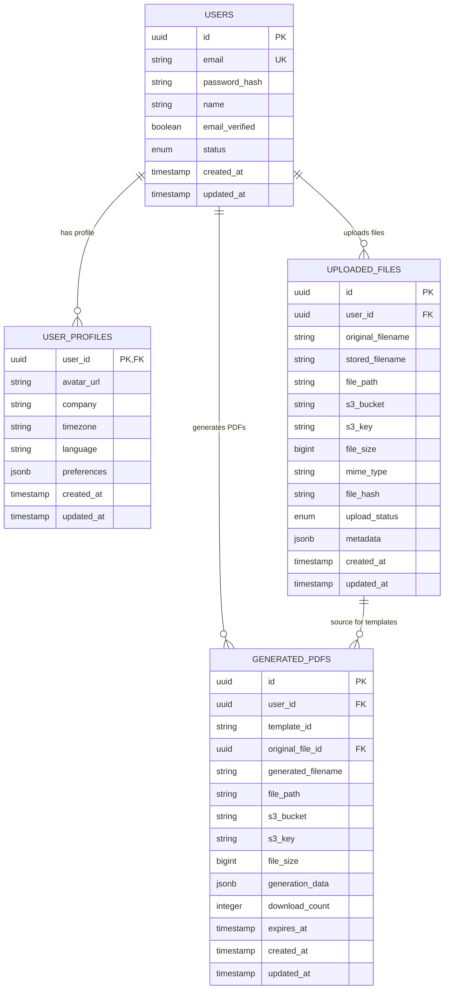

#### AWS RDS Configuration
- **Engine**: PostgreSQL 15.4 with optimized parameters
- **Instance Classes**: 
  - Development: `db.t3.micro`
  - Staging: `db.t3.small` 
  - Production: `db.t3.medium` with Multi-AZ
- **Storage**: GP3 SSD with auto-scaling (20GB → 500GB)
- **Backups**: Automated with 7-30 day retention
- **Security**: VPC isolation, encrypted at rest and in transit
- **Monitoring**: Performance Insights and CloudWatch integration

### AWS DynamoDB Schema (Document Data)

```mermaid
graph TB
    subgraph "DynamoDB Tables with Embedded Properties"
        T[Templates Table]
        F[Fields Table with Embedded Properties]
    end
    
    subgraph "Templates Structure"
        T --> T1[templateId: PK]
        T --> T2[userId: GSI - References RDS]
        T --> T3[originalFileId - References RDS]
        T --> T4[name, dimensions, scale]
        T --> T5[pageCount, version, status]
        T --> T6[metadata, timestamps]
    end
    
    subgraph "Fields Structure with Embedded Properties"
        F --> F1[fieldId: PK]
        F --> F2[templateId: GSI]
        F --> F3[name, type, page]
        F --> F4[position, size, bindingKey]
        F --> F5[Embedded Style Properties]
        F --> F6[Embedded Layout Properties]
        F --> F7[Embedded Advanced Properties]
        F --> F8[Embedded Validation Properties]
        F --> F9[Table Config for Complex Fields]
    end
    
    subgraph "Embedded Style Properties"
        F5 --> S1[fontFamily, fontSize]
        F5 --> S2[textColor, backgroundColor]
        F5 --> S3[textAlign, bold, italic]
        F5 --> S4[lineThickness, lineStyle, opacity]
    end
    
    subgraph "Embedded Layout Properties"
        F6 --> L1[rotation, lockProportions]
        F6 --> L2[layerOrder, snapToGrid]
    end
    
    subgraph "Embedded Advanced Properties"
        F7 --> A1[placeholder, required]
        F7 --> A2[multiLine, maxLength]
        F7 --> A3[visibility settings]
    end
    
    subgraph "Embedded Validation Properties"
        F8 --> V1[type, regexPattern]
        F8 --> V2[errorMessage, constraints]
    end
    
    T -.->|1:N| F
```

#### AWS DynamoDB Configuration

**Templates Table**: `pdf-studio-templates-{stage}`
- **Primary Key**: `templateId` (String)
- **GSI**: `UserIdIndex` (userId, createdAt), `StatusIndex` (status, updatedAt)
- **Billing**: On-demand with auto-scaling
- **Backup**: Point-in-time recovery enabled
- **Purpose**: Store template metadata with cross-references to RDS

**Fields Table**: `pdf-studio-fields-{stage}`
- **Primary Key**: `fieldId` (String)
- **GSI**: `TemplateIdIndex` (templateId, page), `TypeIndex` (type, createdAt)
- **Billing**: On-demand with auto-scaling
- **Backup**: Point-in-time recovery enabled
- **Purpose**: Store field definitions with embedded style, layout, advanced, and validation properties

#### Key Improvements
- **Embedded Properties**: Eliminates need for separate style/validation tables
- **Reduced Queries**: Single query retrieves complete field configuration
- **Better Performance**: Sub-10ms response times with embedded data
- **Simplified Schema**: Fewer tables to manage and maintain

## Data Flow & Communication

### AWS Serverless Architecture Overview
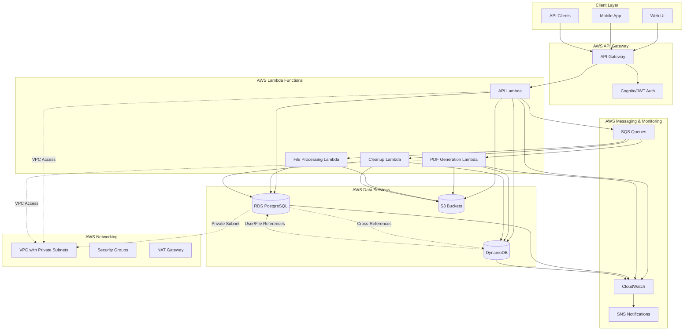

### Data Flow Patterns

#### 1. User Registration & Authentication
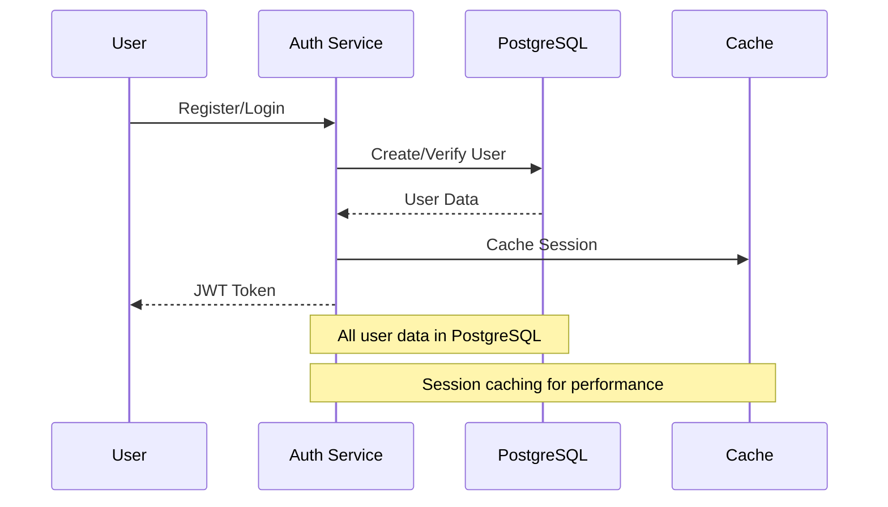

#### 2. File Upload & Template Creation
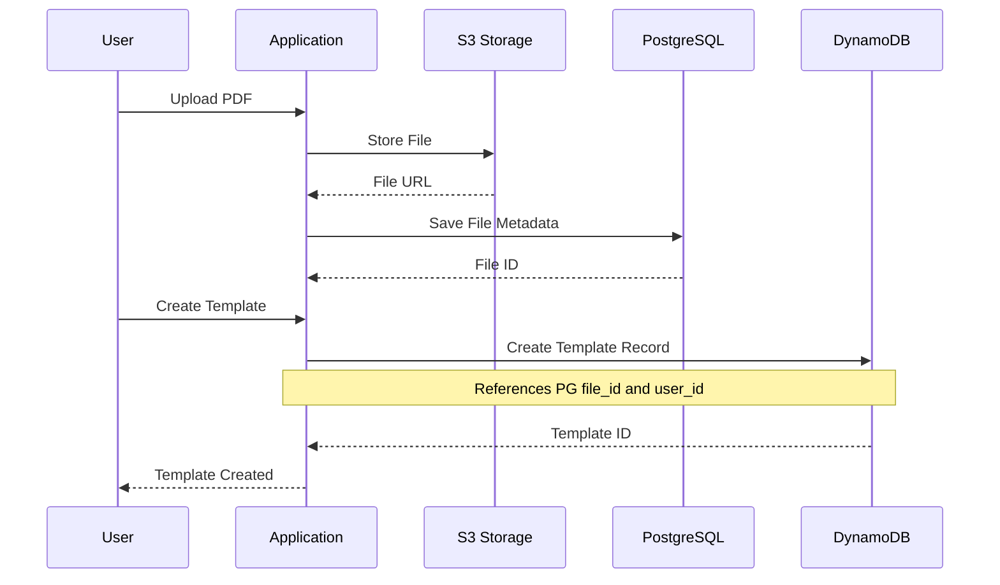

#### 3. Template Editing (Real-time)
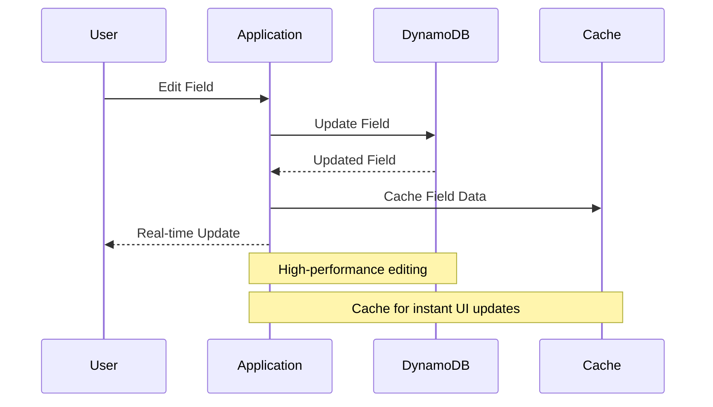

#### 4. PDF Generation (Asynchronous with SQS)
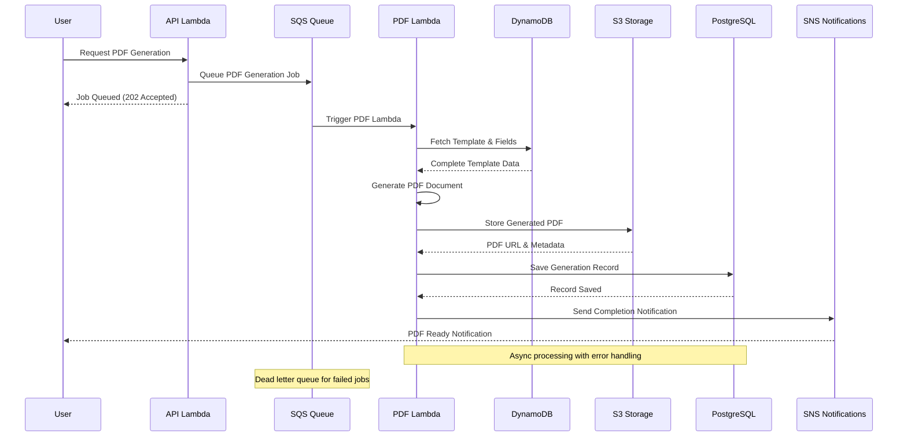

#### 5. Analytics & Reporting
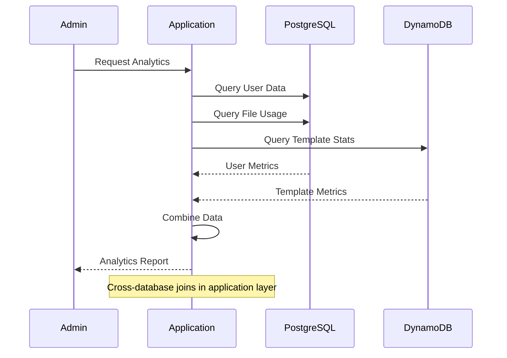

## Cross-Database Relationships

### Reference Architecture
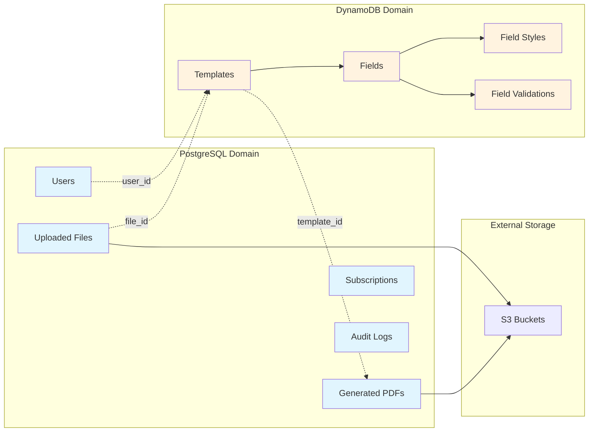

### Data Consistency Patterns

#### 1. Reference Integrity
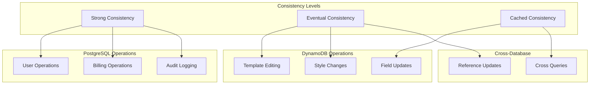

#### 2. Synchronization Strategies
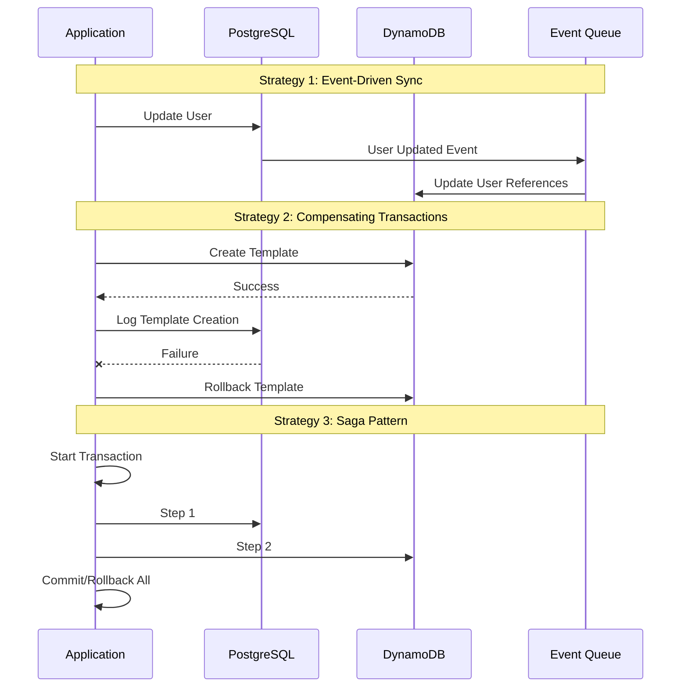

## Performance Optimizations

### AWS Serverless Performance Strategy
```mermaid
graph TB
    subgraph "AWS Performance Layers"
        CF[CloudFront CDN]
        APIGW[API Gateway Caching]
        LAMBDA[Lambda Optimization]
        DB[Database Layer]
    end
    
    subgraph "RDS PostgreSQL Optimizations"
        PG_POOL[Prisma Connection Pooling]
        PG_INDEX[Automated Index Recommendations]
        PG_INSIGHTS[Performance Insights]
        PG_REPLICA[Read Replicas for Analytics]
        PG_CACHE[Query Result Caching]
    end
    
    subgraph "DynamoDB Optimizations"
        DDB_ONDEMAND[On-Demand Auto-Scaling]
        DDB_GSI[Optimized GSI Design]
        DDB_BATCH[Batch Operations]
        DDB_DAX[DynamoDB Accelerator (Optional)]
        DDB_STREAMS[DynamoDB Streams for Real-time]
    end
    
    subgraph "Lambda Optimizations"
        LAMBDA_WARM[Provisioned Concurrency]
        LAMBDA_LAYERS[Shared Lambda Layers]
        LAMBDA_VPC[VPC Connection Reuse]
        LAMBDA_MEMORY[Right-sized Memory]
    end
    
    subgraph "SQS & Async Processing"
        SQS_BATCH[Batch Message Processing]
        SQS_PARALLEL[Parallel Queue Processing]
        SQS_DLQ[Dead Letter Queue Handling]
    end
    
    CF --> APIGW
    APIGW --> LAMBDA
    LAMBDA --> DB
    
    DB --> PG_POOL
    DB --> PG_INDEX
    DB --> PG_INSIGHTS
    DB --> PG_REPLICA
    DB --> PG_CACHE
    
    DB --> DDB_ONDEMAND
    DB --> DDB_GSI
    DB --> DDB_BATCH
    DB --> DDB_DAX
    DB --> DDB_STREAMS
    
    LAMBDA --> LAMBDA_WARM
    LAMBDA --> LAMBDA_LAYERS
    LAMBDA --> LAMBDA_VPC
    LAMBDA --> LAMBDA_MEMORY
    
    LAMBDA --> SQS_BATCH
    LAMBDA --> SQS_PARALLEL
    LAMBDA --> SQS_DLQ
```

### Performance Metrics & Targets

#### AWS RDS PostgreSQL
- **Connection Time**: < 100ms (with connection pooling)
- **Query Response**: < 50ms for simple queries, < 200ms for complex joins
- **Throughput**: 1000+ queries/second with read replicas
- **Availability**: 99.95% with Multi-AZ deployment

#### AWS DynamoDB
- **Read Latency**: < 10ms (single-digit milliseconds)
- **Write Latency**: < 10ms (single-digit milliseconds)
- **Throughput**: Auto-scales to handle any traffic volume
- **Availability**: 99.999% with global tables

#### AWS Lambda
- **Cold Start**: < 1s with provisioned concurrency
- **Warm Execution**: < 100ms for API operations
- **Concurrency**: 1000+ concurrent executions
- **Memory Efficiency**: Right-sized per function (128MB - 3GB)

### Query Performance Patterns
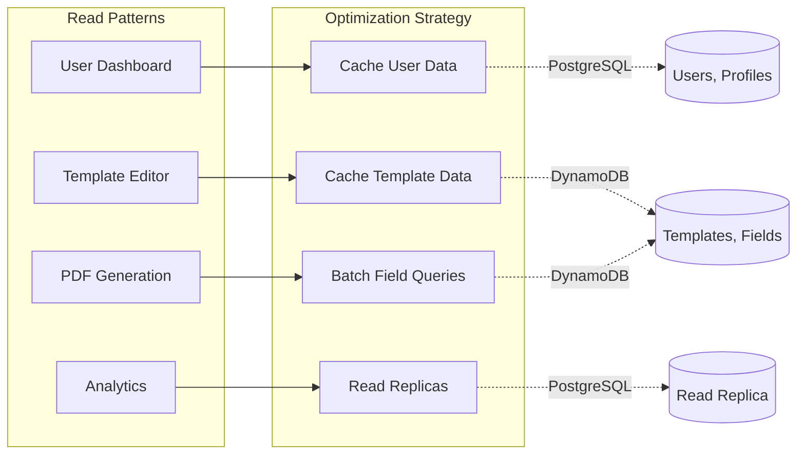

## Backup & Recovery

### PostgreSQL
- **Automated Backups**: Daily full backups with point-in-time recovery
- **Cross-Region Replication**: For disaster recovery
- **Schema Migrations**: Versioned migration scripts

### DynamoDB
- **Point-in-Time Recovery**: Enable PITR for all tables
- **Cross-Region Replication**: Global tables for critical data
- **Export to S3**: Regular exports for analytics

## Security Considerations

### Access Control
- **PostgreSQL**: Role-based access with least privilege
- **DynamoDB**: IAM policies with resource-level permissions
- **Application Level**: JWT-based authentication with user context

### Data Encryption
- **At Rest**: Both databases encrypted at rest
- **In Transit**: TLS for all database connections
- **Application**: Sensitive data hashed/encrypted before storage

## Monitoring & Observability

### Metrics to Track
- **PostgreSQL**: Connection count, query performance, disk usage
- **DynamoDB**: Read/write capacity, throttling, hot partitions
- **Cross-Database**: Query latency, consistency lag, error rates

### Alerting
- **Performance**: Slow queries, high CPU/memory usage
- **Availability**: Connection failures, timeout errors
- **Consistency**: Data sync failures between databases

## Deployment Strategy

### AWS Infrastructure Deployment Timeline
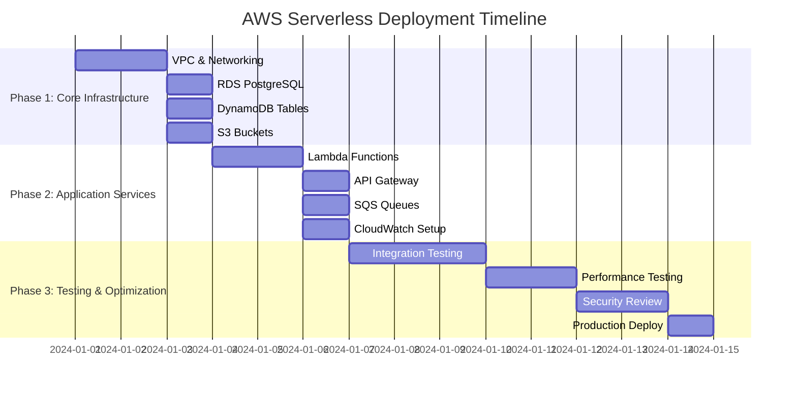

### Serverless Deployment Flow
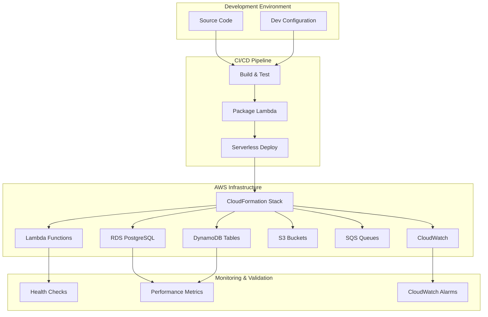

### Deployment Commands
```bash
# Quick deployment (all stages)
./scripts/deploy.sh --stage dev
./scripts/deploy.sh --stage staging  
./scripts/deploy.sh --stage prod

# Infrastructure only
serverless deploy --stage prod

# Database migrations
npm run db:migrate:deploy

# Monitoring setup
aws cloudwatch put-dashboard --dashboard-name pdf-studio-prod
```

## Cost Optimization

### AWS Cost Management Strategy

#### RDS PostgreSQL Cost Optimization
- **Instance Right-sizing**: Start with `db.t3.micro` (dev) → scale to `db.t3.medium` (prod)
- **Reserved Instances**: 40-60% savings for predictable production workloads
- **Storage Optimization**: GP3 SSD with auto-scaling (pay for what you use)
- **Multi-AZ**: Only enable for production environments
- **Automated Backups**: Optimize retention periods (7 days dev, 30 days prod)

#### DynamoDB Cost Optimization
- **On-Demand Billing**: Perfect for unpredictable traffic patterns
- **Auto-Scaling**: Automatically adjusts capacity based on demand
- **TTL Implementation**: Automatic cleanup of expired data (no storage costs)
- **GSI Optimization**: Only create necessary indexes
- **Point-in-Time Recovery**: Enable only for critical production tables

#### Lambda Cost Optimization
- **Right-sized Memory**: Optimize memory allocation per function
- **Provisioned Concurrency**: Only for critical, latency-sensitive functions
- **VPC Configuration**: Minimize cold starts with connection reuse
- **Execution Time**: Optimize code for faster execution (lower costs)

#### S3 Cost Optimization
- **Storage Classes**: Use Intelligent Tiering for automatic cost optimization
- **Lifecycle Policies**: Move old files to cheaper storage classes
- **Compression**: Compress files before storage
- **Multipart Uploads**: Optimize large file uploads

#### SQS Cost Optimization
- **Batch Processing**: Process multiple messages per invocation
- **Long Polling**: Reduce empty receives (20-second polling)
- **Dead Letter Queues**: Prevent infinite retry costs
- **Message Retention**: Optimize retention periods

### Cost Monitoring & Alerts

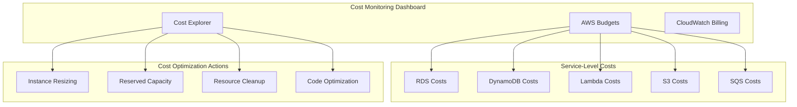

### Estimated Monthly Costs (USD)

#### Development Environment
- **RDS PostgreSQL**: $15-25 (db.t3.micro)
- **DynamoDB**: $5-15 (on-demand, low traffic)
- **Lambda**: $5-10 (pay-per-execution)
- **S3**: $5-10 (standard storage)
- **SQS**: $1-3 (message processing)
- **CloudWatch**: $5-10 (logs and metrics)
- **Total**: ~$36-73/month

#### Production Environment
- **RDS PostgreSQL**: $100-200 (db.t3.medium, Multi-AZ)
- **DynamoDB**: $50-150 (on-demand, higher traffic)
- **Lambda**: $50-100 (higher execution volume)
- **S3**: $20-50 (intelligent tiering)
- **SQS**: $10-20 (higher message volume)
- **CloudWatch**: $20-40 (detailed monitoring)
- **Total**: ~$250-560/month

### Cost Optimization Best Practices

1. **Monitor Daily**: Set up billing alerts and daily cost monitoring
2. **Tag Resources**: Implement comprehensive resource tagging for cost allocation
3. **Regular Reviews**: Monthly cost optimization reviews
4. **Automation**: Use AWS Cost Anomaly Detection for unusual spending
5. **Reserved Capacity**: Purchase reserved instances for stable workloads
6. **Cleanup Policies**: Implement automated cleanup for temporary resources

This AWS serverless architecture provides optimal cost efficiency by scaling resources based on actual usage while maintaining high performance and reliability.